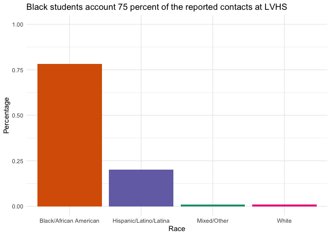
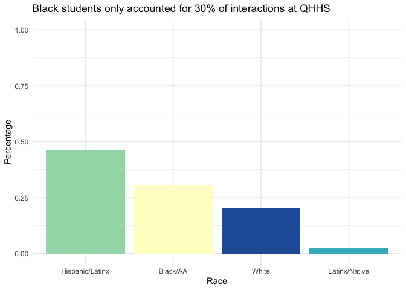

================
Greg Morton


## Data Bulletproofing: ProPublica/KPCC/LAist

## [In The Antelope Valley, Sheriff’s Deputies Settle Schoolyard Disputes. Black Teens Bear the Brunt](https://www.propublica.org/article/in-a-california-desert-sheriffs-deputies-settle-schoolyard-disputes-black-teens-bear-the-brunt)

Bulletproofing is an essential final step in ensuring a data driven
story is ready for publication. Whether verifying facts in the story,
backing up claims with evidence, or framing the piece’s argument, it is
very important to ensure that the story being told in a piece is aligned
with reality.

I was lucky enough to have the opportunity to contribute data
bulletproofing to Irena Hwang and Emily Elena Dugdale’s
ProPublica/KPCC/LAist story on interactions between Black students and
police in California’s Antelope Valley.

During this process I verified the claims made in the story by
recreating Irena’s Python analysis of data provided by the LA County
Sheriff’s department in R. This gave me an opportunity not only to
verify the findings themselves, but to test the methodology behind those
findings in another programming language.

## Police Interactions at K-12 Schools

The analysis started with a raw file containing data on over 330,000
police contacts in LA County.

``` r
AntValleyRaw %>%
  head()
```

    ## # A tibble: 6 × 140
    ##   CONTACT_ID PATROL_STATION DATE_TIME   NUMBER_OF_MINUT… STREET_NUMBER DIRECTION
    ##        <dbl> <chr>          <chr>                  <dbl>         <dbl> <chr>    
    ## 1      12875 WHD            07/01/2018…                6            NA <NA>     
    ## 2      12879 WHD            07/01/2018…                6           100 <NA>     
    ## 3      12881 WHD            07/01/2018…                5            NA <NA>     
    ## 4      12889 SLA            07/01/2018…              110          1200 W        
    ## 5      12889 SLA            07/01/2018…              110          1200 W        
    ## 6      12889 SLA            07/01/2018…              110          1200 W        
    ## # … with 134 more variables: STREET <chr>, TYPE <chr>, SUITE <chr>,
    ## #   CROSS_STREET <chr>, LANDMARK <chr>, FULL_STREET <chr>, CITY <chr>,
    ## #   STATE <chr>, ZIP_CODE <dbl>, K_12_SCHOOL <lgl>, SCHOOL_NAME <chr>,
    ## #   CALL_FOR_SERVICE <lgl>, CIVILIANS_CONTACTED <dbl>, Person ID <dbl>,
    ## #   Street # <dbl>, Street Direction <chr>, Street Name <chr>,
    ## #   Street Type <chr>, Suite <chr>, Cross Street <chr>, Landmark <chr>,
    ## #   Full Address <chr>, City <chr>, State <chr>, Zip Code <dbl>, Age? <dbl>, …

This data contains a multitude of variables that allowed me to filter
and subset the data. This includes a few geospatial identifiers like
Patrol Station, address, latitude, and longitude that allowed us to
easily identify police contacts that took place at or around Antelope
Valley schools.

Filtering for interactions handled by the Lancaster Sheriff’s office
(the primary arm of LA County police in Antelope Valley), we arrived at
a “cleaned” dataset containing info on about 4,000 police interactions

``` r
AntValleyClean %>%
  head()
```

    ## # A tibble: 6 × 141
    ##   CONTACT_ID PATROL_STATION DATE_TIME           NUMBER_OF_MINUTES STREET_NUMBER
    ##        <dbl> <chr>          <dttm>                          <dbl>         <dbl>
    ## 1     137350 LAN            2019-01-01 00:50:00                10         42900
    ## 2     137375 LAN            2019-01-01 03:04:00                60            NA
    ## 3     137377 LAN            2019-01-01 05:00:00                20         45500
    ## 4     137410 LAN            2019-01-01 11:56:00                 5            NA
    ## 5     137434 LAN            2019-01-01 12:28:00                10         43900
    ## 6     137562 LAN            2019-01-01 22:48:00                15          1500
    ## # … with 136 more variables: DIRECTION <chr>, STREET <chr>, TYPE <chr>,
    ## #   SUITE <chr>, CROSS_STREET <chr>, LANDMARK <chr>, FULL_STREET <chr>,
    ## #   CITY <chr>, STATE <chr>, ZIP_CODE <dbl>, K_12_SCHOOL <lgl>,
    ## #   SCHOOL_NAME <chr>, CALL_FOR_SERVICE <lgl>, CIVILIANS_CONTACTED <dbl>,
    ## #   Person ID <dbl>, Street # <dbl>, Street Direction <chr>, Street Name <chr>,
    ## #   Street Type <chr>, Suite <chr>, Cross Street <chr>, Landmark <chr>,
    ## #   Full Address <chr>, City <chr>, State <chr>, Zip Code <dbl>, Age? <dbl>, …

### What the Police Reported

Police data makes note of interactions that take place at a K-12 school.
But how much can we rely upon this data?

In order to independently verify the number of interactions that took
place at a school we begin by deriving the Sheriff’s Department’s
original figure from their data. Below is a subset of the data that
includes stops in 2019 for “Reasonable suspiician that the person was
engaged in a criminal activity” that the police noted took place at a
K-12 school.

``` r
AntValleyRaw %>% 
  filter(str_detect(toupper(DATE_TIME), "2019"),
         str_detect(toupper(`Reason for Contact`), "REASONABLE SUSPICION THAT THE PERSON WAS ENGAGED IN CRIMINAL ACTIVITY"),
         CITY == 'LANCASTER',
         K_12_SCHOOL == TRUE
         ) %>%
  head(10)
```

    ## # A tibble: 10 × 140
    ##    CONTACT_ID PATROL_STATION DATE_TIME  NUMBER_OF_MINUT… STREET_NUMBER DIRECTION
    ##         <dbl> <chr>          <chr>                 <dbl>         <dbl> <chr>    
    ##  1     145314 LAN            01/15/201…               60         44300 W        
    ##  2     145706 LAN            01/16/201…               10          6000 W        
    ##  3     145781 LAN            01/16/201…               60         44300 W        
    ##  4     146743 LAN            01/18/201…               10          4400 W        
    ##  5     146743 LAN            01/18/201…               10          4400 W        
    ##  6     150478 LAN            01/24/201…               60         44300 W        
    ##  7     150897 LAN            01/25/201…                5          6000 W        
    ##  8     152472 LAN            01/28/201…               15            NA <NA>     
    ##  9     152973 LAN            01/29/201…               15         43800 W        
    ## 10     153123 LAN            01/29/201…                1          6000 W        
    ## # … with 134 more variables: STREET <chr>, TYPE <chr>, SUITE <chr>,
    ## #   CROSS_STREET <chr>, LANDMARK <chr>, FULL_STREET <chr>, CITY <chr>,
    ## #   STATE <chr>, ZIP_CODE <dbl>, K_12_SCHOOL <lgl>, SCHOOL_NAME <chr>,
    ## #   CALL_FOR_SERVICE <lgl>, CIVILIANS_CONTACTED <dbl>, Person ID <dbl>,
    ## #   Street # <dbl>, Street Direction <chr>, Street Name <chr>,
    ## #   Street Type <chr>, Suite <chr>, Cross Street <chr>, Landmark <chr>,
    ## #   Full Address <chr>, City <chr>, State <chr>, Zip Code <dbl>, Age? <dbl>, …

The police noted 289 such contacts.

``` r
count(sanity_check_1)
```

    ## # A tibble: 1 × 1
    ##       n
    ##   <int>
    ## 1   289

### What the Police Data was Missing

These 289 stops do not tell the full story of the interactions between
police and students in Antelope Valley. By performing geospatial
analysis and running a clustering algorithm in python, Irena was able to
assign interactions to schools rather than taking the data at face
value. Large numbers of arrests in close physical proximity (as was
often the case at schools) were grouped into numbered clusters. Stops
taking place at or adjacent to schools were assigned a cluster code.

``` r
school_codes
```

    ## # A tibble: 29 × 2
    ##    School                            Code
    ##    <chr>                            <dbl>
    ##  1 Amargosa Creek Middle              816
    ##  2 Antelope Valley Adventist School   817
    ##  3 Antelope Valley High               818
    ##  4 Bethel Christian Academy           819
    ##  5 Desert Christian High School       820
    ##  6 Discovery Elementary               821
    ##  7 Eastside High                      822
    ##  8 Eastside Union School District     823
    ##  9 El Dorado Elementary School        824
    ## 10 Gifford C. Cole Middle             825
    ## # … with 19 more rows

This method allowed us not only to discern which stops were happening at
which schools and which schools had the most encounters between students
and police, but also to verify our findings against what the LA County
Sheriff’s Department reported in its official documentation. Since each
interaction included geospatial info (latitude and longitude), we were
able to take great care in verifying that each of the interactions
identified by the algorithm indeed took place at or adjacent to a K-12
school in Antelope Valley.

``` r
AntValleyClean %>%
  filter(Cluster %in% school_codes$Code)
```

    ## # A tibble: 406 × 141
    ##    CONTACT_ID PATROL_STATION DATE_TIME           NUMBER_OF_MINUTES STREET_NUMBER
    ##         <dbl> <chr>          <dttm>                          <dbl>         <dbl>
    ##  1     137375 LAN            2019-01-01 03:04:00                60            NA
    ##  2     141217 LAN            2019-01-08 12:40:00                10           100
    ##  3     145277 LAN            2019-01-15 08:00:00                10         45700
    ##  4     145314 LAN            2019-01-15 11:30:00                60         44300
    ##  5     145706 LAN            2019-01-16 10:20:00                10          6000
    ##  6     145781 LAN            2019-01-16 11:00:00                60         44300
    ##  7     146743 LAN            2019-01-18 10:30:00                10          4400
    ##  8     146743 LAN            2019-01-18 10:30:00                10          4400
    ##  9     146846 LAN            2019-01-18 18:04:00                20          3200
    ## 10     148457 LAN            2019-01-22 12:00:00                10         44900
    ## # … with 396 more rows, and 136 more variables: DIRECTION <chr>, STREET <chr>,
    ## #   TYPE <chr>, SUITE <chr>, CROSS_STREET <chr>, LANDMARK <chr>,
    ## #   FULL_STREET <chr>, CITY <chr>, STATE <chr>, ZIP_CODE <dbl>,
    ## #   K_12_SCHOOL <lgl>, SCHOOL_NAME <chr>, CALL_FOR_SERVICE <lgl>,
    ## #   CIVILIANS_CONTACTED <dbl>, Person ID <dbl>, Street # <dbl>,
    ## #   Street Direction <chr>, Street Name <chr>, Street Type <chr>, Suite <chr>,
    ## #   Cross Street <chr>, Landmark <chr>, Full Address <chr>, City <chr>, …

Using Irena’s method, we were able to identify 406 interactinos at
Antelope Valley schools

``` r
count(sanity_check_2)
```

    ## # A tibble: 1 × 1
    ##       n
    ##   <int>
    ## 1   406

## Story Bulletproofing

The next part of the bulletproofing process individual facts from the
story. In this section, I will examine claims made in the story and go
in depth on how I verified
them.

#### “More than 80% of those contacts with LASD deputies involved youths between the ages of five and 19.”

``` r
AntValleyClean %>%
  filter(Cluster %in% school_codes$Code) %>%
  filter(`Age?` >= 5 & `Age?`<= 19)
```

    ## # A tibble: 343 × 141
    ##    CONTACT_ID PATROL_STATION DATE_TIME           NUMBER_OF_MINUTES STREET_NUMBER
    ##         <dbl> <chr>          <dttm>                          <dbl>         <dbl>
    ##  1     141217 LAN            2019-01-08 12:40:00                10           100
    ##  2     145314 LAN            2019-01-15 11:30:00                60         44300
    ##  3     145706 LAN            2019-01-16 10:20:00                10          6000
    ##  4     146743 LAN            2019-01-18 10:30:00                10          4400
    ##  5     146743 LAN            2019-01-18 10:30:00                10          4400
    ##  6     146846 LAN            2019-01-18 18:04:00                20          3200
    ##  7     150478 LAN            2019-01-24 15:00:00                60         44300
    ##  8     150897 LAN            2019-01-25 09:45:00                 5          6000
    ##  9     152973 LAN            2019-01-29 12:00:00                15         43800
    ## 10     153123 LAN            2019-01-29 11:40:00                 1          6000
    ## # … with 333 more rows, and 136 more variables: DIRECTION <chr>, STREET <chr>,
    ## #   TYPE <chr>, SUITE <chr>, CROSS_STREET <chr>, LANDMARK <chr>,
    ## #   FULL_STREET <chr>, CITY <chr>, STATE <chr>, ZIP_CODE <dbl>,
    ## #   K_12_SCHOOL <lgl>, SCHOOL_NAME <chr>, CALL_FOR_SERVICE <lgl>,
    ## #   CIVILIANS_CONTACTED <dbl>, Person ID <dbl>, Street # <dbl>,
    ## #   Street Direction <chr>, Street Name <chr>, Street Type <chr>, Suite <chr>,
    ## #   Cross Street <chr>, Landmark <chr>, Full Address <chr>, City <chr>, …

``` r
minor_stops_cluster <-AntValleyClean %>%
  filter(Cluster %in% school_codes$Code) %>%
  filter(`Age?` >= 5 & `Age?`<= 19)
```

We begin by subsetting our record of Police Interactions handled by
Lancaster PD and filtering for interactions taking place in one of the
clusters identified as a school by the algorithm. When finish by
filtering for interactions involving children between age 5 and 19
(while there is a variable that identifies an interaction as one with a
K-12 student, not all of these students are correctly identified). I
named this object “minor\_stops\_cluster”.

``` r
count(minor_stops_cluster) / count(sanity_check_2)
```

    ##           n
    ## 1 0.8448276

Next, it’s as simple as division to figure out the proportion of of
stops within our school cluster involving students. From this we can see
that about 84% of these stops involved students.

### “Black Students account for about 60 percent of these interactions”

``` r
AntValleyClean %>%
  filter(Cluster %in% school_codes$Code) %>%
  filter(`Age?` >= 5 & `Age?`<= 19) %>%
  count(Race, sort = T) %>%
  mutate(RacePct = n / 343)
```

    ## # A tibble: 10 × 3
    ##    Race                                                                n RacePct
    ##    <chr>                                                           <int>   <dbl>
    ##  1 Black/African American                                            198 0.577  
    ##  2 Hispanic/Latino/Latina                                             93 0.271  
    ##  3 White                                                              22 0.0641 
    ##  4 Asian, Black/African American, Hispanic/Latino/Latina, Middle …    18 0.0525 
    ##  5 Black/African American, Hispanic/Latino/Latina                      6 0.0175 
    ##  6 Hispanic/Latino/Latina, White                                       2 0.00583
    ##  7 Asian, Black/African American, Hispanic/Latino/Latina, White        1 0.00292
    ##  8 Black/African American, Hispanic/Latino/Latina, White               1 0.00292
    ##  9 Hispanic/Latino/Latina, Middle Eastern/South Asian                  1 0.00292
    ## 10 Hispanic/Latino/Latina, Native American                             1 0.00292

This is very similar to our first question. All we have to do is add a
race filter on top of our age filter and count interactions by
race.

### Black students made up just over 60 percent over all students cited after being questioned “under reasonable suspicion”

``` r
AntValleyClean %>%
  filter(Cluster %in% school_codes$Code) %>%
  filter(`Age?` >= 5 & `Age?`<= 19) %>%
filter(str_detect(toupper(`Reason for Contact`), "REASONABLE SUSPICION THAT THE PERSON WAS ENGAGED IN CRIMINAL ACTIVITY")) %>%
  filter(`Result of Contact:  In-field Cite and Release?` == T) %>%
  filter(`Age?` >= 5 & `Age?`<= 19) %>%
  count(Race, sort = T) %>%
  mutate(RacePCT = n / 257)
```

    ## # A tibble: 8 × 3
    ##   Race                                                                 n RacePCT
    ##   <chr>                                                            <int>   <dbl>
    ## 1 Black/African American                                             158 0.615  
    ## 2 Hispanic/Latino/Latina                                              68 0.265  
    ## 3 Asian, Black/African American, Hispanic/Latino/Latina, Middle E…    17 0.0661 
    ## 4 White                                                               10 0.0389 
    ## 5 Asian, Black/African American, Hispanic/Latino/Latina, White         1 0.00389
    ## 6 Black/African American, Hispanic/Latino/Latina                       1 0.00389
    ## 7 Hispanic/Latino/Latina, Native American                              1 0.00389
    ## 8 Hispanic/Latino/Latina, White                                        1 0.00389

As simple as adding an additional filter and counting
again.

### They were cited for fighting, for marijana possession and for battery against a school employee, among other violations.

``` r
AntValleyClean %>%
  filter(str_detect(toupper(`Reason for Contact`), "REASONABLE SUSPICION THAT THE PERSON WAS ENGAGED IN CRIMINAL ACTIVITY")) %>%
  filter(`Age?` >= 5 & `Age?`<= 19) %>%
  filter(Race == "Black/African American") %>%
  filter(`Result of Contact:  In-field Cite and Release?` ==T) %>%
  count(`Result of Contact:  In-field Cite and Release Offense Codes?`, sort=T)
```

    ## # A tibble: 33 × 2
    ##    `Result of Contact:  In-field Cite and Release Offense Codes?`     n
    ##    <chr>                                                          <int>
    ##  1 415(1)                                                            75
    ##  2 11357(D)                                                          18
    ##  3 243.6                                                             15
    ##  4 243.2(A)(1)                                                       11
    ##  5 243.2(A)                                                          10
    ##  6 242                                                                8
    ##  7 32210                                                              3
    ##  8 330                                                                3
    ##  9 484(A)                                                             3
    ## 10 626.10(A)(1)                                                       3
    ## # … with 23 more rows

This is a very important piece of data becaus it makes the case that
these minor offenses that would in many districts be handled by school
administrators are causing Black students in Antelope Valley to be
criminalized and thrusting them into a justice session that is
particularly unforgiving to them.

Finding the most common citation codes issued to these students is again
just a matter of filtering and
counting.

### “Black students account for about a third of the school’s enrollment, but 75 percent of the reported contacts involved Black teenagers.”

In this section, we take a closer look at Antelope Valley High School,
one of the largest hubs for student/police interactions in the area.

``` r
AntValleyClean %>%
  filter(Cluster == 818) %>%
  filter(`Age?` >= 5 & `Age?`<= 19) %>%
  filter(str_detect(toupper(`Reason for Contact`), "REASONABLE SUSPICION THAT THE PERSON WAS ENGAGED IN CRIMINAL ACTIVITY")) %>%
  count(Race, sort = T) %>%
  mutate(RacePct = n / 119)
```

    ## # A tibble: 4 × 3
    ##   Race                                                                 n RacePct
    ##   <chr>                                                            <int>   <dbl>
    ## 1 Black/African American                                              93 0.782  
    ## 2 Hispanic/Latino/Latina                                              24 0.202  
    ## 3 Asian, Black/African American, Hispanic/Latino/Latina, Middle E…     1 0.00840
    ## 4 White                                                                1 0.00840

<!-- -->

### “78% of citations at Antelope Valley High were given to Black students. The single police contact with a white student did not result in a citation the number of contacts at Quartz Hill High, located on the city’s more affluent west side, were much lower though about a quarter of contacts with deputies at Quartz Hill High were reported as involving Black students, they account for only 9.4% of the student body. The number of citations at Quartz Hill high were also much lower, though, 31% of citations there were given to Black students compared to 21% of white students.”

``` r
AntValleyClean %>%
  filter(Cluster %in% school_codes$Code) %>%
   filter(Cluster == 833) %>%
  filter(`Age?` >= 5 & `Age?`<= 19) %>%
  filter(str_detect(toupper(`Reason for Contact`), "REASONABLE SUSPICION THAT THE PERSON WAS ENGAGED IN CRIMINAL ACTIVITY")) %>%
  filter(`Result of Contact:  In-field Cite and Release?`) %>%
  count(Race, sort = T) %>%
  mutate(RacePct = n / 39)
```

    ## # A tibble: 4 × 3
    ##   Race                                        n RacePct
    ##   <chr>                                   <int>   <dbl>
    ## 1 Hispanic/Latino/Latina                     18  0.462 
    ## 2 Black/African American                     12  0.308 
    ## 3 White                                       8  0.205 
    ## 4 Hispanic/Latino/Latina, Native American     1  0.0256

<!-- -->

This piece of data is important because it shows the extent to which
Black children are overrepresented in police interactions at Antelope
Valley HS.

### Aditional Resources

I also go into the details of my analysis in this [data
memo](https://docs.google.com/document/d/1_o2OcP6OTwtmY38PfIWG76lbo6hhm0i_jKtaMuEkMgw/edit?usp=sharing)
that I wrote for ProPublica both to assist the reporters and to aid in
making the analysis easier to recreate.
